# vue-naive-admin 项目架构图（基于源码重新梳理）

> 本文档由通读 `src/`、`build/`、`vite.config.ts` 源码后重新绘制，与代码实际实现一一对应。
> 图例：`──▶` 编译期 import 依赖　`-.->` 运行时调用/读写　`==▶` 网络请求

---

## 一、整体分层架构图

```mermaid
flowchart TD
    subgraph BROWSER["🌐 浏览器运行时"]
        direction TB

        subgraph L0["① 入口引导层 · src 根"]
            direction LR
            MAIN["main.ts<br/>bootstrap() 启动编排"]
            APPV["App.vue<br/>根组件 · 主题/布局/KeepAlive 总装"]
            SET["settings.ts<br/>默认布局·主色·基础权限"]
            DIR["directives/index.ts<br/>v-permission / withPermission"]
        end

        subgraph L1["② 页面视图层 · src/views"]
            direction LR
            V_LOGIN["login<br/>登录"]
            V_PMS["pms<br/>user / role / resource"]
            V_PROFILE["profile<br/>个人中心"]
            V_OTHER["home / base / demo<br/>iframe / error-page"]
        end

        subgraph L2["③ 布局层 · src/layouts"]
            direction LR
            L_NORMAL["normal<br/>顶栏+侧栏"]
            L_FULL["full<br/>完整模式"]
            L_SIMPLE["simple<br/>极简模式"]
            L_EMPTY["empty<br/>空白"]
            L_COMP["layouts/components<br/>SideMenu·BreadCrumb·AppTab<br/>UserAvatar·RoleSelect·Fullscreen"]
        end

        subgraph L3["③' 组件层 · src/components"]
            direction LR
            C_COMMON["common<br/>AppPage·AppCard·LayoutSetting<br/>ThemeSetting·ToggleTheme·TheLogo"]
            C_ME["me<br/>MeCrud 表格壳<br/>MeQueryItem 查询件<br/>MeModal 弹窗壳"]
        end

        subgraph L4["④ 组合式逻辑层 · src/composables"]
            direction LR
            K_CRUD["useCrud ★<br/>CRUD 总装胶水"]
            K_MODAL["useModal<br/>弹窗遥控"]
            K_FORM["useForm<br/>表单与校验"]
            K_ALIVE["useAliveData<br/>路由级数据缓存"]
        end

        subgraph L5["⑤ 状态层 · src/store (Pinia)"]
            direction LR
            S_APP["app<br/>布局/暗黑/主色"]
            S_AUTH["auth<br/>accessToken"]
            S_USER["user<br/>userInfo + getters"]
            S_PERM["permission<br/>accessRoutes/menus"]
            S_ROUTER["router<br/>router/route 实例代理"]
            S_TAB["tab<br/>多标签页"]
        end

        subgraph L6["⑥ 路由层 · src/router"]
            direction LR
            R_BASIC["basic-routes<br/>4 条静态路由"]
            R_GUARD["guards ×4<br/>page-loading / permission<br/>page-title / tab"]
        end

        subgraph L7["⑦ 服务接口层"]
            direction LR
            A_GLOBAL["api/index.ts<br/>用户·权限·校验"]
            A_VIEWS["views/**/api.ts<br/>就近拆分接口"]
        end

        subgraph L8["⑧ 基础设施层 · src/utils"]
            direction LR
            U_HTTP["http<br/>axios 实例 + 双向拦截器 + 错误码"]
            U_STORE["storage<br/>lStorage / sStorage"]
            U_TOOL["naiveTools<br/>离散 API 全局化"]
            U_COMMON["common / is<br/>时间·节流·类型判断"]
        end

        subgraph L9["⑨ 构建期 · build + vite.config.ts"]
            direction LR
            B_ICON["plugin-isme/icons<br/>isme:icons 虚拟模块"]
            B_PATH["plugin-isme/page-pathes<br/>isme:page-pathes 虚拟模块"]
            B_AUTO["unplugin-auto-import<br/>vue / vue-router API"]
            B_COMP["unplugin-vue-components<br/>NaiveUiResolver"]
        end
    end

    subgraph EXT["⑩ 外部依赖与后端"]
        direction LR
        D_CORE["Vue 3.5 · Router 5 · Pinia 3"]
        D_UI["Naive UI 2 · UnoCSS · ECharts"]
        D_LIB["axios · @vueuse/core<br/>lodash-es · dayjs · xlsx"]
        BACKEND[("后端服务<br/>VITE_AXIOS_BASE_URL")]
    end

    %% ---- 启动编排 ----
    MAIN -->|"1 setupStore"| L5
    MAIN -->|"2 setupDirectives"| DIR
    MAIN -->|"3 setupRouter (await)"| L6
    MAIN -->|"4 mount"| APPV
    MAIN -->|"5 setupNaiveDiscreteApi"| U_TOOL

    %% ---- App.vue 总装 ----
    APPV --> SET
    APPV --> L5
    APPV -->|"按 route.meta.layout<br/>异步加载 + Map 缓存"| L2
    APPV --> C_COMMON

    %% ---- 视图 ----
    L1 --> L2
    L1 --> L3
    L1 --> L4
    L1 --> L7
    L1 --> DIR

    %% ---- 布局 ----
    L2 --> L5
    L2 --> L_COMP
    L_COMP --> L3
    L_COMP --> L5
    L_COMP --> L7
    L_COMP --> L4

    %% ---- 组件 ----
    C_COMMON --> L5
    C_ME -->|"运行时 ref 连接"| K_CRUD

    %% ---- composables ----
    K_CRUD --> K_MODAL
    K_CRUD --> K_FORM
    K_CRUD -.->|"仅类型/工具"| U_COMMON

    %% ---- 路由与状态 ----
    L6 --> L5
    L6 --> L1
    R_GUARD --> R_BASIC
    R_GUARD --> L5
    R_GUARD --> L7
    R_GUARD --> U_TOOL
    S_AUTH --> L7
    S_PERM --> U_COMMON

    %% ---- 接口 ----
    L7 --> U_HTTP
    L7 -.->|"直接用裸 axios<br/>取 components.json"| D_LIB

    %% ---- 基础设施 ----
    U_HTTP -->|"取 accessToken"| S_AUTH
    U_HTTP -.->|"过期 → logout"| S_AUTH
    U_TOOL --> S_APP
    U_STORE --> U_COMMON
    L5 -->|"persistedstate"| U_STORE

    %% ---- 构建期 ----
    L0 -.-> B_AUTO
    L0 -.-> B_COMP
    L1 -.-> B_PATH
    L1 -.-> B_ICON

    %% ---- 外部 ----
    L5 -.-> D_CORE
    L2 -.-> D_UI
    L3 -.-> D_UI
    L4 -.-> D_LIB
    U_HTTP ==> BACKEND

    classDef entry   fill:#4f46e5,stroke:#312e81,color:#fff
    classDef view    fill:#0ea5e9,stroke:#0369a1,color:#fff
    classDef layout  fill:#06b6d4,stroke:#0e7490,color:#fff
    classDef comp    fill:#10b981,stroke:#047857,color:#fff
    classDef logic   fill:#84cc16,stroke:#4d7c0f,color:#fff
    classDef state   fill:#f59e0b,stroke:#b45309,color:#fff
    classDef route   fill:#f97316,stroke:#c2410c,color:#fff
    classDef api     fill:#ef4444,stroke:#b91c1c,color:#fff
    classDef infra   fill:#64748b,stroke:#334155,color:#fff
    classDef build   fill:#0f766e,stroke:#134e4a,color:#fff
    classDef dep     fill:#a855f7,stroke:#7e22ce,color:#fff

    class MAIN,APPV,SET,DIR entry
    class V_LOGIN,V_PMS,V_PROFILE,V_OTHER view
    class L_NORMAL,L_FULL,L_SIMPLE,L_EMPTY,L_COMP layout
    class C_COMMON,C_ME comp
    class K_CRUD,K_MODAL,K_FORM,K_ALIVE logic
    class S_APP,S_AUTH,S_USER,S_PERM,S_ROUTER,S_TAB state
    class R_BASIC,R_GUARD route
    class A_GLOBAL,A_VIEWS api
    class U_HTTP,U_STORE,U_TOOL,U_COMMON infra
    class B_ICON,B_PATH,B_AUTO,B_COMP build
    class D_CORE,D_UI,D_LIB dep
```

### 分层职责速查

| 层           | 目录                                            | 实际职责                                                                                                                                             |
| ------------ | ----------------------------------------------- | ---------------------------------------------------------------------------------------------------------------------------------------------------- |
| ① 入口引导   | `main.ts` `App.vue` `settings.ts` `directives/` | 严格按 `setupStore → setupDirectives → setupRouter → mount → setupNaiveDiscreteApi` 装配；`App.vue` 是「主题 + 布局 + 过渡 + KeepAlive」的唯一总装点 |
| ② 页面视图   | `src/views/`                                    | 业务页面只做两件事：写配置（columns / queryItems）+ 写接口函数；权限靠 `withPermission` 声明                                                         |
| ③ 布局       | `src/layouts/`                                  | 4 套壳 `normal / full / simple / empty`，由 `route.meta.layout` 或 `appStore.layout` 决定；框架级导航件集中在 `layouts/components`                   |
| ③' 组件      | `src/components/`                               | `common` 通用 UI 件；`me` 业务「半成品」件（MeCrud 表格壳 / MeModal 弹窗壳 / MeQueryItem 查询件）                                                    |
| ④ 组合式逻辑 | `src/composables/`                              | `useCrud` 是唯一胶水，把「开弹窗→填表→校验→调接口→提示→刷新列表」串成一条循环                                                                        |
| ⑤ 状态       | `src/store/`                                    | 6 个 Pinia 模块；只放**登录态 / 权限 / 布局偏好 / 多标签**这类全局状态，业务列表数据不进 store                                                       |
| ⑥ 路由       | `src/router/`                                   | 仅 4 条静态路由（`/login` `/` `/404` `/403`），其余全部由权限动态 `addRoute` 生成；4 个守卫按序注册                                                  |
| ⑦ 服务接口   | `src/api/index.ts` + `views/**/api.ts`          | 跨模块接口聚合在 `api/index.ts`，模块私有接口就近放 `views/**/api.ts`                                                                                |
| ⑧ 基础设施   | `src/utils/`                                    | axios 实例与拦截器、带过期时间的存储封装、NaiveUI 离散 API 全局化、通用工具                                                                          |
| ⑨ 构建期     | `build/plugin-isme/*` + `vite.config.ts`        | 自研虚拟模块（图标清单、页面路径清单）+ 自动导入 + 组件自动注册                                                                                      |

---

## 二、应用启动时序图

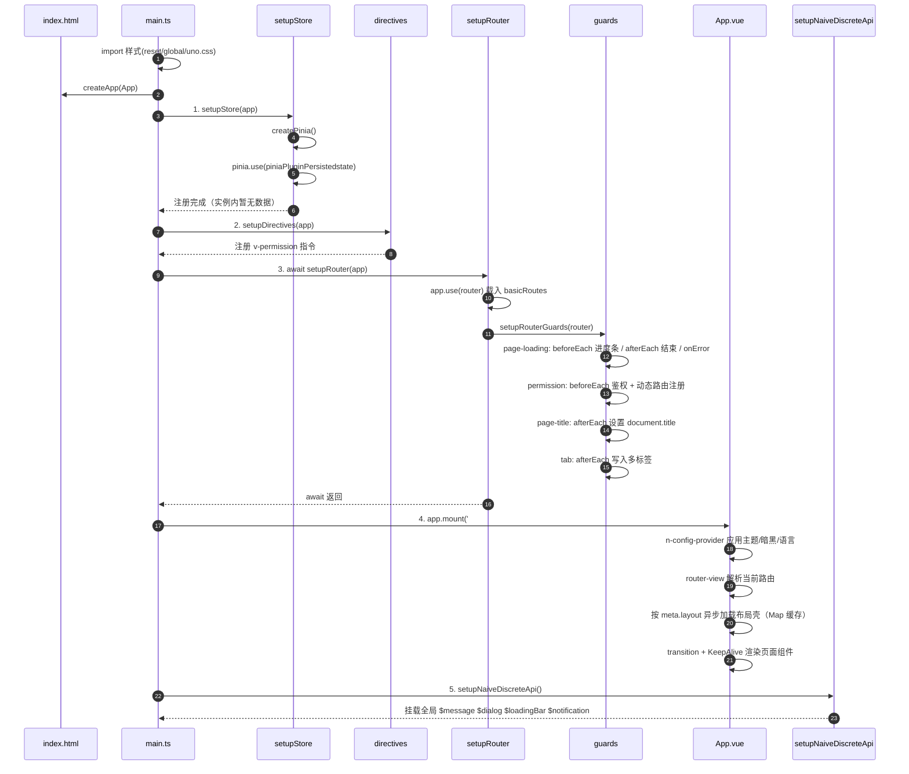

**启动关键点**

| 序号 | 动作                    | 作用                                                              |
| ---- | ----------------------- | ----------------------------------------------------------------- |
| 1    | `setupStore`            | 仅创建 Pinia 容器并挂上持久化插件，**此时没有任何业务数据**       |
| 2    | `setupDirectives`       | 注册 `v-permission`，权限校验靠读 `route.meta.btns`               |
| 3    | `await setupRouter`     | 唯一 await 点，等路由与 4 个守卫就绪后才 mount，避免首屏闪烁      |
| 4    | `mount`                 | `App.vue` 承担「主题 → 布局 → 过渡 → KeepAlive」四级嵌套          |
| 5    | `setupNaiveDiscreteApi` | 必须在 mount 之后，让 `utils` 与 `store` 都能安全拿到运行期上下文 |

---

## 三、App.vue 四级渲染链路

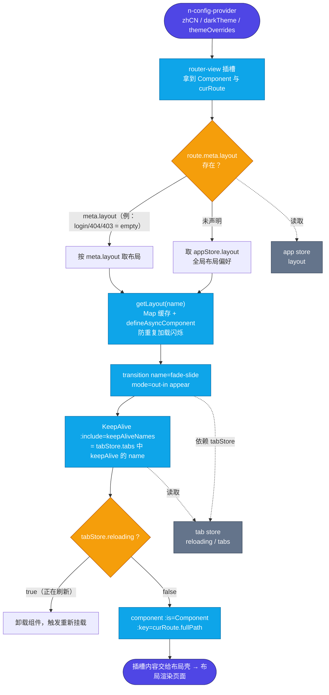

**要点**

- 布局选择优先级：**`route.meta.layout` > `appStore.layout`**，因此单个页面可强制用 `empty`（登录页、403、404）。
- `layouts` 用 `Map` + `markRaw` 缓存布局组件，避免每次路由变化都重新 `import()` 导致闪烁。
- 刷新单个标签页的原理：`tabStore.reloadTab()` 把 `reloading` 置 `true` 再置回 `false`，配合 `v-if` 强制卸载并重建组件，`keepAlive` 临时摘除以保证重新请求数据。

---

## 四、登录与动态路由注册时序图（项目最核心链路）

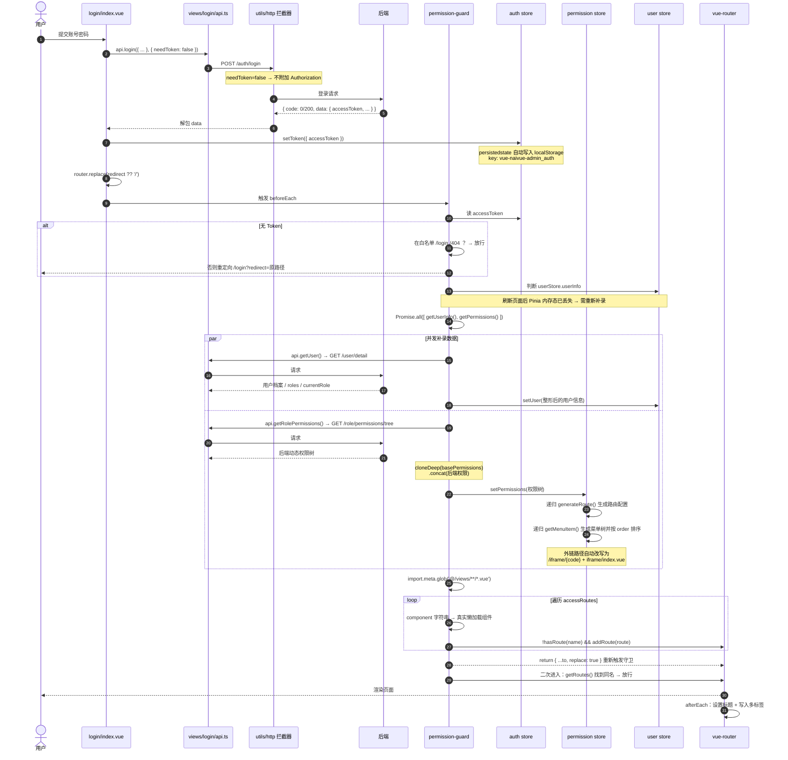

### 权限守卫决策树（permission-guard.ts）

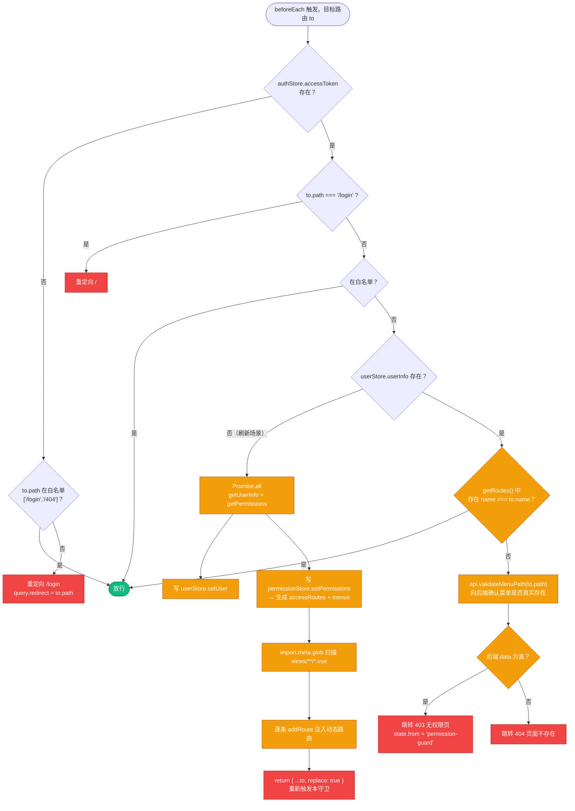

---

## 五、权限数据模型与三类权限项

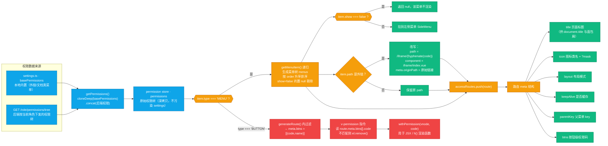

| 权限类型 | `type`                    | 落地位置                                                  | 消费方                                                 |
| -------- | ------------------------- | --------------------------------------------------------- | ------------------------------------------------------ |
| 菜单     | `MENU`                    | `permission.menus` + `accessRoutes`                       | `SideMenu.vue` 渲染左侧导航；`addRoute` 注册可访问路由 |
| 按钮     | `BUTTON`                  | `route.meta.btns`（只取 `code`）                          | `v-permission` 指令 / `withPermission()`               |
| 外链     | `MENU` 且 path 为 http(s) | 自动改写为 `/iframe/{code}`，`meta.originPath` 保留原地址 | `views/iframe/index.vue` 内嵌渲染                      |

---

## 六、状态层（Pinia）模块全景与持久化策略

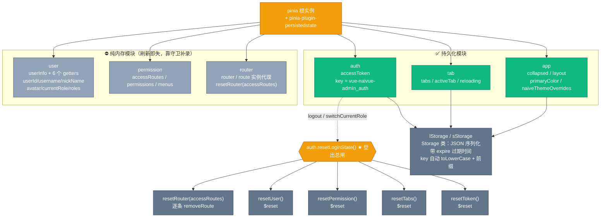

### Store 模块对照表

| 模块         | 写法           | State                                                                       | Getters                                                       | 关键 Actions                                                                                                   | 持久化                         |
| ------------ | -------------- | --------------------------------------------------------------------------- | ------------------------------------------------------------- | -------------------------------------------------------------------------------------------------------------- | ------------------------------ |
| `app`        | options        | `collapsed` `isDark`(useDark) `layout` `primaryColor` `naiveThemeOverrides` | —                                                             | `switchCollapsed` `setCollapsed` `toggleDark` `setLayout` `setPrimaryColor` `setThemeColor`                    | ✅ sessionStorage，pick 4 字段 |
| `auth`       | options        | `accessToken`                                                               | —                                                             | `setToken` `resetToken` `toLogin` `switchCurrentRole` `resetLoginState` `logout`                               | ✅ key `vue-naivue-admin_auth` |
| `user`       | options        | `userInfo`                                                                  | `userId` `username` `nickName` `avatar` `currentRole` `roles` | `setUser` `resetUser`                                                                                          | ⛔ 不持久化                    |
| `permission` | options        | `accessRoutes` `permissions` `menus`                                        | —                                                             | `setPermissions` `getMenuItem`(递归) `generateRoute` `resetPermission`                                         | ⛔ 不持久化                    |
| `router`     | **setup 语法** | `router` `route`（来自 `useRouter/useRoute`）                               | —                                                             | `resetRouter(accessRoutes)`                                                                                    | ⛔ 不持久化                    |
| `tab`        | options        | `tabs` `activeTab` `reloading`                                              | `activeIndex`                                                 | `setActiveTab` `setTabs` `addTab` `reloadTab` `removeTab` `removeOther` `removeLeft` `removeRight` `resetTabs` | ✅                             |

**设计约束（源码可验证）**

1. `user` / `permission` 不持久化是**刻意为之**：敏感信息与动态路由表不应落盘，刷新后由 `permission-guard` 通过 `Promise.all` 重新补录。
2. `app` 用 `sessionStorage`，关掉浏览器即失效；`auth` 用默认 `localStorage`，保证「记住登录态」。
3. `resetLoginState()` 是唯一的登出总闸，串起 5 个模块的重置，避免残留脏路由。

---

## 七、路由守卫注册顺序与职责

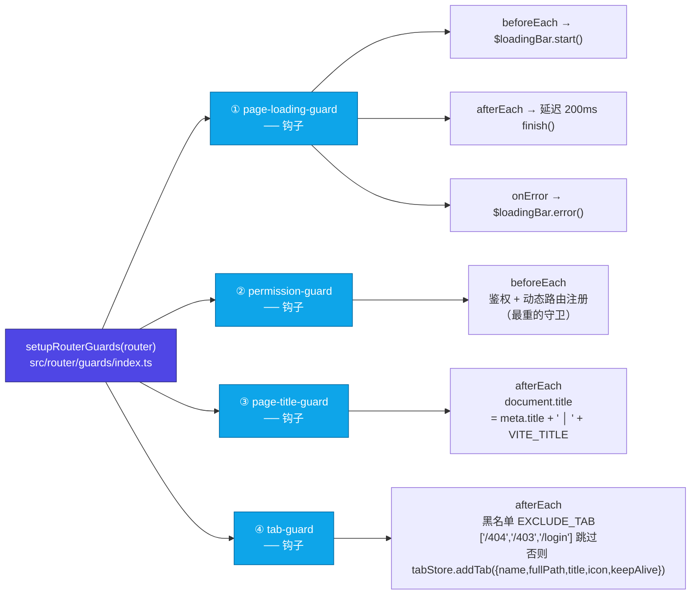

**关键顺序原因**：`permission-guard` 必须先于 `page-title` 与 `tab` 完成，因为它会 `addRoute` 并 `replace` 重入。若标题与标签先写入，重入时 `to.meta` 可能还是空的。

---

## 八、业务页面「配置 + 接口」极简模式（以 pms/user 为例）

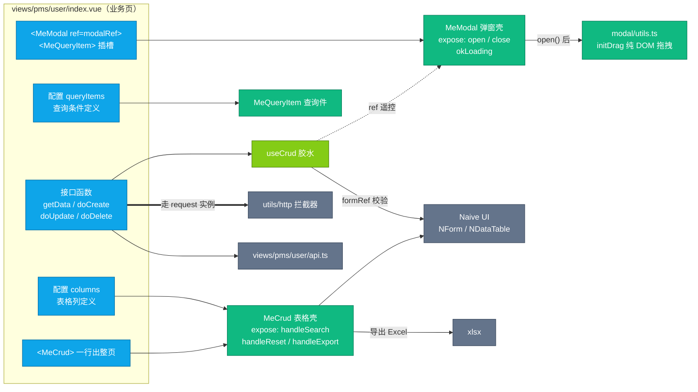

**MeCrud 内部约定**

| 项   | 约定                                          |
| ---- | --------------------------------------------- |
| 入参 | `{ pageNo, pageSize }`（`pageSize` 默认 10）  |
| 出参 | `{ pageData, total }`                         |
| 搜索 | `handleSearch(keepCurrentPage = false)`       |
| 重置 | `handleReset()`                               |
| 导出 | `handleExport(columns?, data?)` → xlsx 写文件 |

---

## 九、一次「新增/编辑保存」的完整数据流

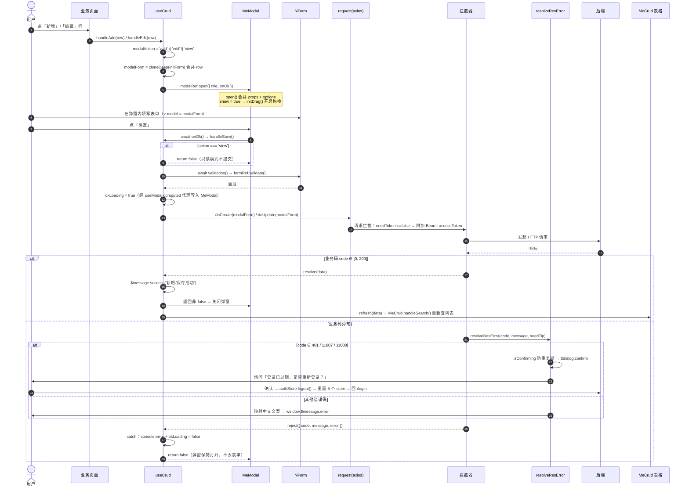

---

## 十、HTTP 层：实例、拦截器与错误码收口

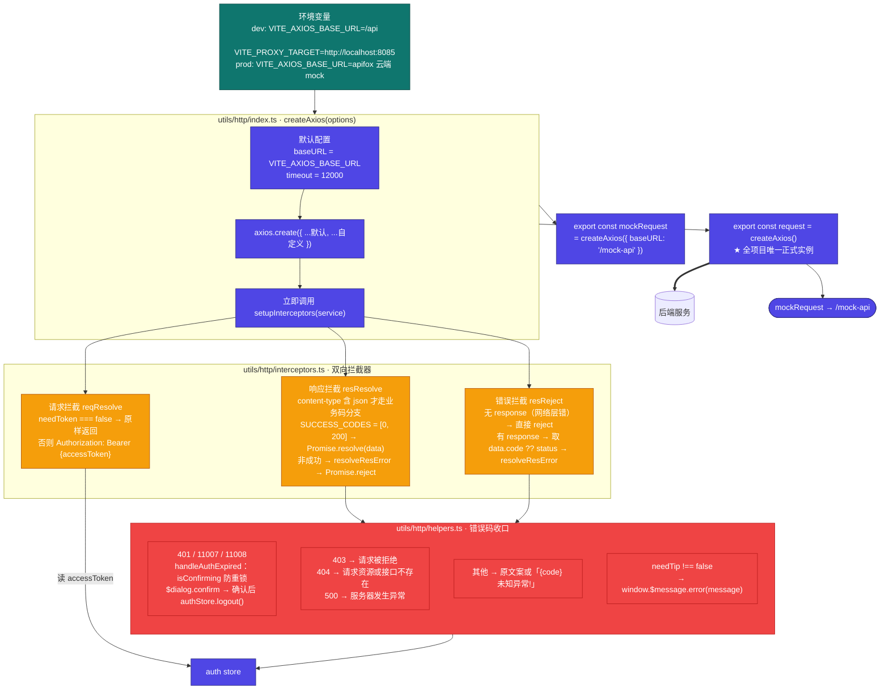

### 错误码 → 行为对照表

| code              | 行为                                                      | 是否弹提示       |
| ----------------- | --------------------------------------------------------- | ---------------- |
| `0` / `200`       | 视为成功，解包 `data` 直接 resolve                        | —                |
| `401`             | 弹「登录已过期，是否重新登录？」确认框，确认后 `logout()` | 确认框           |
| `11007` / `11008` | 同 401，文案携带后端 `message`                            | 确认框           |
| `403`             | 映射为「请求被拒绝」                                      | `$message.error` |
| `404`             | 映射为「请求资源或接口不存在」                            | `$message.error` |
| `500`             | 映射为「服务器发生异常」                                  | `$message.error` |
| 其他              | 用后端文案，兜底「`{code}` 未知异常!」                    | `$message.error` |

**单请求级开关**：`{ needToken: false }` 跳过 token（如 `login/api.ts` 的登录接口）；`{ needTip: false }` 静默失败（如 `api.logout()`）。

---

## 十一、构建链路与虚拟模块

```mermaid
flowchart TB
    subgraph CFG["vite.config.ts"]
        LOAD["loadEnv(mode, cwd)<br/>读出 VITE_PUBLIC_PATH / VITE_PROXY_TARGET"]
        BASE["base = VITE_PUBLIC_PATH || '/'"]
        PLUGINS["插件数组（按序）"]
        ALIAS["resolve.alias<br/>@ → src<br/>~ → 项目根"]
        DEV["server: port 3200, host 0.0.0.0<br/>proxy /api → VITE_PROXY_TARGET<br/>rewrite 去掉 /api 前缀<br/>proxyRes 注入 x-real-url 响应头"]
        BUILD["build.chunkSizeWarningLimit = 1024"]
        OD["optimizeDeps.include: ['vue3-intro-step']"]
    end

    subgraph PLUG["插件链"]
        P1["@vitejs/plugin-vue<br/>SFC 编译"]
        P2["@vitejs/plugin-vue-jsx<br/>JSX / render 函数"]
        P3["vite-plugin-vue-devtools"]
        P4["unocss/vite<br/>原子化 CSS"]
        P5["unplugin-auto-import<br/>自动注入 vue / vue-router 的 API<br/>（故 store/router 中可直接用 ref、computed、<br/>useRoute、nextTick、unref、h）"]
        P6["unplugin-vue-components<br/>NaiveUiResolver 自动注册 N* 组件"]
        P7["★ build/plugin-isme/page-pathes.ts<br/>glob('src/views/**/*.vue')<br/>→ 虚拟模块 'isme:page-pathes'"]
        P8["★ build/plugin-isme/icons.ts<br/>glob('src/assets/icons/feather/*.svg')<br/>glob('src/assets/icons/isme/*.svg')<br/>+ dynamic-icons.ts<br/>→ 虚拟模块 'isme:icons'"]
        P9["vite-plugin-router-warn<br/>消除动态路由的 No match 噪音"]
    end

    subgraph RES["产出的能力"]
        R1["vite 直接消费<br/>src/**"]
        R2["virtual: isme:page-pathes<br/>页面路径清单数组"]
        R3["virtual: isme:icons<br/>i-fe:* / i-me:* 图标类名数组"]
        R4["UnoCSS 生成的 uno.css<br/>（main.ts 中 import 'uno.css'）"]
        R5["构建产物 dist/<br/>Hash 模式(dev) / History 模式(prod)"]
    end

    LOAD --> BASE
    LOAD --> DEV
    CFG --> PLUGINS
    P1 --> R1
    P2 --> R1
    P4 --> R4
    P5 --> R1
    P6 --> R1
    P7 --> R2
    P8 --> R3
    P9 --> R1
    P2 --> R5
    P1 --> R5
    ALIAS --> R1
    R4 --> R1
    BUILD --> R5
    OD --> R5

    classDef c fill:#4f46e5,stroke:#312e81,color:#fff
    classDef p fill:#0f766e,stroke:#134e4a,color:#fff
    classDef star fill:#f59e0b,stroke:#b45309,color:#fff
    classDef r fill:#10b981,stroke:#047857,color:#fff
    class LOAD,BASE,PLUGINS,ALIAS,DEV,BUILD,OD,CFG c
    class P1,P2,P3,P4,P5,P6,P9 p
    class P7,P8 star
    class R1,R2,R3,R4,R5 r
```

---

## 十二、目录 → 模块对照地图

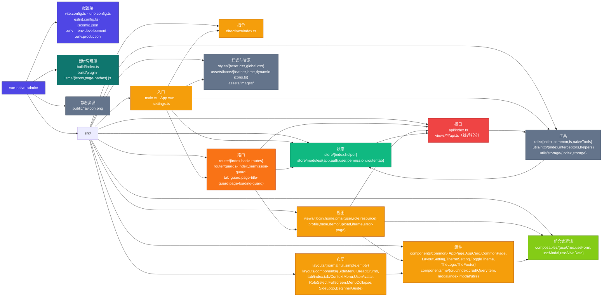

### 关键依赖规则（源码可验证）

1. **单向依赖**：`views → layouts/components → components → composables → store → api → utils`，禁止反向 import。
2. **逻辑层与组件层零耦合**：`useModal` / `useForm` 通过 **ref 运行时遥控** `MeModal` / `NForm`，而不是 import 它们；只有 `useCrud` 在页面 setup 里把两端接起来。
3. **守卫只读 store**：`router` 是骨架层，`permission-guard` 读 `auth/user/permission`，store 不 import router（`router` store 只是把 `useRouter()` 结果包一层）。
4. **store 不放业务数据**：只有登录态、权限、布局偏好、多标签四类全局状态入 store，列表数据全部留在页面 `ref` 中。
5. **接口就近存放**：模块私有接口写 `views/**/api.ts`，跨模块共享（用户详情、权限树、菜单校验）才进 `api/index.ts`。
6. **错误处理单点收口**：所有 HTTP 异常最终汇入 `resolveResError`，页面层 `catch` 只需 `console.error`。

---

## 十三、构建期 vs 运行期：能力来源一览

| 能力                                                                                   | 来源                                                                         | 生效时机                         | 使用方                           |
| -------------------------------------------------------------------------------------- | ---------------------------------------------------------------------------- | -------------------------------- | -------------------------------- |
| `ref` `computed` `watch` `h` `unref` `markRaw` `defineAsyncComponent` `withDirectives` | `unplugin-auto-import`（`vue`）                                              | 构建期注入                       | 全项目免 import                  |
| `useRoute` `useRouter`                                                                 | `unplugin-auto-import`（`vue-router`）                                       | 构建期注入                       | `store/modules/router.ts`、组件  |
| `nextTick`                                                                             | `unplugin-auto-import`（`vue`）                                              | 构建期注入                       | `auth` / `tab` store             |
| `NButton` `NDataTable` `NForm` 等                                                      | `unplugin-vue-components` + `NaiveUiResolver`                                | 构建期按模板标签自动注册         | 所有 `.vue`                      |
| `i-fe:*` `i-me:*` `i-simple-icons:*`                                                   | `build/plugin-isme/icons.ts` 虚拟模块 + UnoCSS                               | 构建期生成类名数组               | 菜单图标、后端下发的 `icon` 字段 |
| 页面路径清单                                                                           | `build/plugin-isme/page-pathes.ts` 虚拟模块                                  | 构建期 glob `src/views/**/*.vue` | 组件选择器 / 路径校验类需求      |
| `$message` `$dialog` `$loadingBar` `$notification`                                     | `utils/naiveTools.ts` 的 `setupNaiveDiscreteApi()`                           | **运行期**挂在 `window` 上       | 拦截器、`useCrud`、各守卫        |
| 路由历史模式（Hash / History）                                                         | `.env.development` = `true` / `.env.production` = `false`                    | 构建期由 `import.meta.env` 决定  | `router/index.ts`                |
| 接口 baseURL                                                                           | `.env.development` = `/api`（走 Vite 代理）/ `.env.production` = apifox mock | 构建期注入                       | `utils/http/index.ts`            |

---

## 十四、架构要点总结

1. **单一入口单线装配**：`main.ts` 用 5 步固定顺序启动，唯一 `await` 在 `setupRouter`，保证守卫就绪后才渲染。
2. **静态极简 + 动态补全**：只写死 4 条公开路由，其余由后端权限树递归生成 `accessRoutes` 并 `addRoute`，实现「菜单、路由、按钮三级权限同源」。
3. **刷新即重建**：Pinia 内存态丢失是设计的一部分，守卫的 `Promise.all` + `replace: true` 重入构成完整的「查票 → 过闸 → 补录」闭环。
4. **App.vue 是唯一总装点**：主题、布局、过渡动画、KeepAlive 四件事集中在根组件，页面层完全不感知。
5. **业务页只写配置**：`columns` + `queryItems` + 5 个接口函数，配合 `useCrud` 就能出一整个 CRUD 页面，页面代码量被压到最低。
6. **基础设施平行且互不依赖**：`utils/http` 与 `utils/storage` 是两条平行线，共同的上游只有 `auth store`（token 与登录态）。
7. **错误与提示单点收口**：拦截器 → `resolveResError` 统一映射中文文案，401 类集中处理登出，页面层不写重复的错误分支。
