# 整体分层架构图

> 依赖方向：**自上而下**。上层可以调用下层，下层不允许反向 import 上层（基础设施层除外的公共工具）。

```mermaid
flowchart TD
    %% ========== 入口引导层 ==========
    subgraph L0["① 入口引导层（src 根）"]
        direction LR
        MAIN["main.js<br/>bootstrap() 启动编排"]
        APP["App.vue<br/>根组件"]
        SET["settings.js<br/>系统默认配置"]
        DIR["directives/<br/>v-permission / v-role 权限指令"]
    end

    %% ========== 页面视图层 ==========
    subgraph L1["② 页面视图层 src/views/"]
        direction LR
        V_LOGIN["login 登录"]
        V_HOME["home 首页"]
        V_PMS["pms 权限管理<br/>user / role / resource"]
        V_PROFILE["profile 个人中心"]
        V_BASE["base / demo<br/>功能示例"]
        V_ERR["error-page 403 / 404"]
        V_FRAME["iframe 内嵌页"]
    end

    %% ========== 布局层 ==========
    subgraph L2["③ 布局层 src/layouts/"]
        direction LR
        L_NORMAL["normal<br/>侧边栏 + 顶栏"]
        L_FULL["full 顶栏模式"]
        L_SIMPLE["simple 简洁模式"]
        L_EMPTY["empty 空白页"]
        L_COMP["layouts/components<br/>SideMenu / BreadCrumb / Tab 多标签<br/>UserAvatar / MenuCollapse ..."]
    end

    %% ========== 组件层 ==========
    subgraph L3["④ 组件层 src/components/"]
        direction LR
        C_COMMON["common 通用组件<br/>AppPage / AppCard / ThemeSetting / TheLogo"]
        C_ME["me 业务组件<br/>crud 表格 CRUD 封装 / modal 弹窗封装"]
    end

    %% ========== 组合式逻辑层 ==========
    subgraph L4["⑤ 组合式逻辑层 src/composables/"]
        direction LR
        K_CRUD["useCrud<br/>增删改查流程"]
        K_FORM["useForm<br/>表单校验"]
        K_MODAL["useModal<br/>弹窗开关"]
        K_ALIVE["useAliveData<br/>keep-alive 数据"]
    end

    %% ========== 状态层 ==========
    subgraph L5["⑥ 状态层 src/store/（Pinia）"]
        direction LR
        S_APP["app 主题/语言/布局"]
        S_AUTH["auth 登录态 Token"]
        S_USER["user 用户信息"]
        S_PERM["permission 菜单与权限码"]
        S_ROUTER["router 动态路由"]
        S_TAB["tab 多标签页"]
        S_PERSIST["pinia-plugin-persistedstate<br/>本地持久化"]
    end

    %% ========== 路由层 ==========
    subgraph L6["⑦ 路由层 src/router/"]
        direction LR
        R_BASIC["basic-routes 静态路由"]
        R_GUARD["guards 路由守卫<br/>permission / tab / page-loading / page-title"]
        R_ADD["动态 addRoute<br/>按权限生成路由表"]
    end

    %% ========== 服务接口层 ==========
    subgraph L7["⑧ 服务接口层 src/api/ + 各模块 api.js"]
        direction LR
        A_INDEX["api/index.js 接口聚合"]
        A_LOGIN["views/login/api.js"]
        A_PMS["views/pms/**/api.js"]
        A_PROFILE["views/profile/api.js"]
    end

    %% ========== 基础设施层 ==========
    subgraph L8["⑨ 基础设施层 src/utils/ + 样式资源"]
        direction LR
        U_HTTP["utils/http<br/>axios 实例 + 请求/响应拦截器"]
        U_STORE["utils/storage<br/>本地存储封装"]
        U_NAIVE["utils/naiveTools / common / is"]
        U_STYLE["styles + assets<br/>reset / global / 图标"]
    end

    %% ========== 外部依赖 ==========
    subgraph L9["⑩ 框架与第三方依赖"]
        direction LR
        D_VUE["Vue 3.5 + Vue Router 5"]
        D_PINIA["Pinia 3"]
        D_UI["Naive UI 2"]
        D_BUILD["Vite 8 + UnoCSS<br/>unplugin-auto-import / vue-components"]
        D_LIB["@vueuse / axios / echarts<br/>lodash-es / dayjs / xlsx"]
    end

    %% ========== 依赖关系 ==========
    MAIN --> DIR
    MAIN --> L1
    MAIN --> L6
    APP --> L2

    L1 --> L2
    L1 --> L3
    L2 --> L3
    L2 --> L5
    L2 --> L6

    L3 --> L4
    L4 --> L5

    L6 --> L5
    R_GUARD --> R_BASIC
    R_ADD --> L1
    R_GUARD -->|"读取登录态 / 权限码"| S_PERM

    L5 --> L7
    L7 --> U_HTTP
    L5 --> S_PERSIST

    L8 --> D_LIB
    L3 -.-> U_STYLE
    L0 -.-> D_BUILD
    L5 -.-> D_PINIA
    L2 -.-> D_UI
    L6 -.-> D_VUE

    U_HTTP ==> BACKEND[("后端接口<br/>VITE_AXIOS_BASE_URL")]

    %% ========== 样式 ==========
    classDef entry fill:#4f46e5,stroke:#312e81,color:#fff
    classDef view fill:#0ea5e9,stroke:#0369a1,color:#fff
    classDef layout fill:#06b6d4,stroke:#0e7490,color:#fff
    classDef comp fill:#10b981,stroke:#047857,color:#fff
    classDef logic fill:#84cc16,stroke:#4d7c0f,color:#fff
    classDef state fill:#f59e0b,stroke:#b45309,color:#fff
    classDef route fill:#f97316,stroke:#c2410c,color:#fff
    classDef api fill:#ef4444,stroke:#b91c1c,color:#fff
    classDef infra fill:#64748b,stroke:#334155,color:#fff
    classDef dep fill:#a855f7,stroke:#7e22ce,color:#fff

    class MAIN,APP,SET,DIR entry
    class V_LOGIN,V_HOME,V_PMS,V_PROFILE,V_BASE,V_ERR,V_FRAME view
    class L_NORMAL,L_FULL,L_SIMPLE,L_EMPTY,L_COMP layout
    class C_COMMON,C_ME comp
    class K_CRUD,K_FORM,K_MODAL,K_ALIVE logic
    class S_APP,S_AUTH,S_USER,S_PERM,S_ROUTER,S_TAB,S_PERSIST state
    class R_BASIC,R_GUARD,R_ADD route
    class A_INDEX,A_LOGIN,A_PMS,A_PROFILE api
    class U_HTTP,U_STORE,U_NAIVE,U_STYLE infra
    class D_VUE,D_PINIA,D_UI,D_BUILD,D_LIB dep
```

## 分层职责

| 层             | 目录                                    | 职责                                                                                                      |
| -------------- | --------------------------------------- | --------------------------------------------------------------------------------------------------------- |
| ① 入口引导层   | `src/main.js`、`App.vue`、`directives/` | 按 `setupStore → setupDirectives → setupRouter → mount → setupNaiveDiscreteApi` 顺序装配应用              |
| ② 页面视图层   | `src/views/`                            | 纯业务页面，只负责数据录入与展示，CRUD 逻辑下沉到 composables                                             |
| ③ 布局层       | `src/layouts/`                          | 4 套布局壳（normal / full / simple / empty）+ 导航、面包屑、多标签等框架件                                |
| ④ 组件层       | `src/components/`                       | `common` 跨页面通用组件；`me` 业务标准件（crud 表格、modal 弹窗）                                         |
| ⑤ 组合式逻辑层 | `src/composables/`                      | 把「开弹窗→填表→校验→调接口→提示→刷新列表」沉淀为 `useCrud / useForm / useModal`                          |
| ⑥ 状态层       | `src/store/`                            | Pinia 模块：app / auth / user / permission / router / tab，`auth` 核心权限不持久化，其余走 persistedstate |
| ⑦ 路由层       | `src/router/`                           | 静态路由 + 4 个守卫（加载态、权限、标题、多标签）+ 按权限动态 `addRoute`                                  |
| ⑧ 服务接口层   | `src/api/`、各模块 `api.js`             | 按视图模块就近拆分接口，统一从 `api/index.js` 聚合                                                        |
| ⑨ 基础设施层   | `src/utils/`、`styles/`、`assets/`      | axios 实例与拦截器、本地存储、NaiveUI 工具、全局样式与图标                                                |
| ⑩ 框架与依赖   | `package.json`                          | Vue3 / Router5 / Pinia3 / Naive UI / Vite8 / UnoCSS 等                                                    |

## 关键依赖规则

1. **单向依赖**：`views → layouts → components → composables → store → api → utils`，禁止下层反向 import 上层；`router` 属于骨架层，与 `store` 协作（守卫**只读** store，store 不 import router）。
2. **路由不直接写业务**：动态路由由 `permission` store + `permission-guard` 生成与校验，页面只按 `meta` 声明权限。
3. **接口就近存放**：每个 `views/**` 自带 `api.js`，只通过 `utils/http` 的 `request` 实例发请求，拦截器统一处理 Token 与错误提示。
4. **状态分域**：业务数据不进 store，store 只放登录态、权限、布局偏好、多标签等全局 UI/权限状态。
