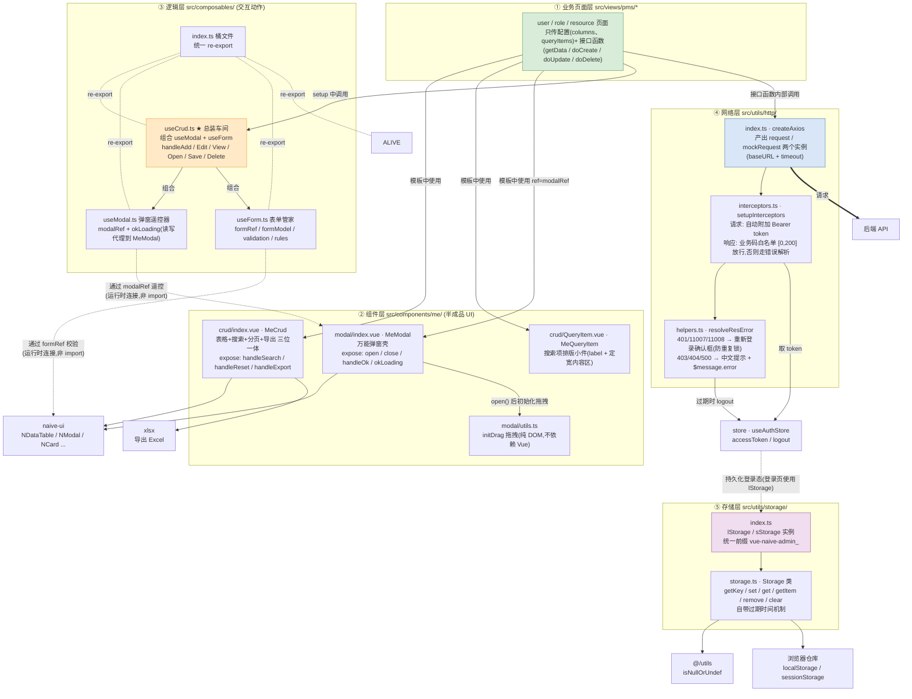
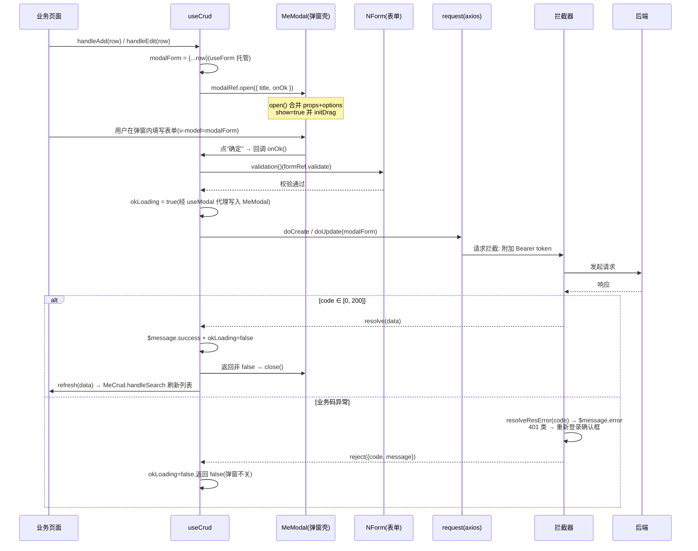

# CRUD 封装体系模块架构图

> 覆盖文件:`src/components/me/{crud,modal}`、`src/composables/*`、`src/utils/http/*`、`src/utils/storage/*`
> 依赖方向:**自上而下**。上层调用下层,下层不反向 import 上层。

## 一、模块依赖全景

## 二、一次"新增/编辑保存"的运行时数据流

## 三、各文件职责速查

| 文件                               | 角色                                                | 关键导出                                                   |
| ---------------------------------- | --------------------------------------------------- | ---------------------------------------------------------- |
| `components/me/crud/index.vue`     | 表格+搜索+分页+导出的半成品                         | MeCrud(expose: handleSearch/handleReset/handleExport)      |
| `components/me/crud/QueryItem.vue` | 搜索项排版件                                        | MeQueryItem(label + 定宽插槽)                              |
| `components/me/modal/index.vue`    | 可拖拽万能弹窗壳                                    | MeModal(expose: open/close/handleOk/okLoading)             |
| `components/me/modal/utils.ts`     | 纯 DOM 拖拽实现                                     | initDrag(bar, box)                                         |
| `composables/useCrud.ts`           | ★ 总装:把弹窗+表单+接口+提示+刷新串成标准 CRUD 循环 | useCrud({name, initForm, doCreate/Delete/Update, refresh}) |
| `composables/useForm.ts`           | 表单状态与校验                                      | useForm → [formRef, formModel, validation, rules]          |
| `composables/useModal.ts`          | 用 ref 遥控 MeModal                                 | useModal → [modalRef, okLoading]                           |
| `composables/useAliveData.ts`      | 按路由名缓存组件数据(暂未使用)                      | useAliveData                                               |
| `utils/http/index.ts`              | axios 实例工厂                                      | createAxios / request / mockRequest                        |
| `utils/http/interceptors.ts`       | 请求附 token、响应验业务码                          | setupInterceptors                                          |
| `utils/http/helpers.ts`            | 错误码 → 中文提示 / 重新登录弹窗                    | resolveResError                                            |
| `utils/storage/index.ts`           | 带前缀的存储实例                                    | lStorage / sStorage                                        |
| `utils/storage/storage.ts`         | 存储类(JSON 序列化 + 过期时间)                      | createStorage / Storage                                    |

## 四、设计要点

1. **三层蛋糕**:naive-ui 零件 → components/me 半成品 → views 业务页。业务页只写"配置 + 接口函数",一行 `<MeCrud/>` 出整页。
2. **useCrud 是唯一的"胶水"**:组件层(Modal/Form)和网络层(request)互相不认识,全靠 useCrud 在页面 setup 里把它们串起来;`modalRef → MeModal` 是**运行时 ref 连接**,不是 import 依赖,所以逻辑层与组件层零耦合。
3. **约定优于配置**:MeCrud 约定出参 `{ pageData, total }`、入参 `{ pageNo, pageSize }`;拦截器约定业务成功码 `[0, 200]`;`needToken: false`、`needTip: false` 可在单个请求上关闭默认行为。
4. **错误处理收口在 helpers.ts**:所有 HTTP 异常最终都汇到 `resolveResError`,401/11007/11008 触发带防重复锁的"重新登录"确认框,页面层 catch 里只需 `console.error`。
5. **storage 与 http 是平行基础设施**:两者互不依赖,共同的上游是 `useAuthStore`(token 存取、登录态持久化)。
